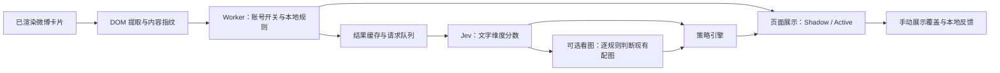

# 微博语义过滤扩展：当前架构

更新：2026-09-24，对应扩展 0.3.5、`weibo-global-v6` 策略、`noul-zh-v3` 语义字段。本文描述当前实现；使用方法见[操作指南](../guides/weibo-extension.md)，需求见[PRD 与已确认补充](../requirements/PRD_Weibo_Semantic_Filter_Chrome_Extension_MVP_v0.2.md)。

## 交付与工程边界

交付个人使用的 Chrome Manifest V3 扩展，源码位于 `extensions/weibo-semantic-filter/`。`dist/` 可直接加载，`artifacts/` 提供同版本 ZIP；未上架 Chrome Web Store。扩展使用 TypeScript、esbuild 和原生 DOM UI，与根目录公司研究系统独立构建、独立测试。

运行需要 Chrome、已登录的微博网页，以及启用语义判断时的模型服务。无需 Node 服务、SQLite 服务、浏览器桥或抓取任务。旧 Node 阅读器与抓取实现已退役，数据库和恢复备份的保留情况见[清理记录](../migrations/weibo-pilot/retirement-2026-09-21.md)。

## 数据流与模块

| 模块 | 职责 |
| --- | --- |
| `src/content/weibo-dom-adapter.ts` | 首页、分组页、账号页卡片提取；MutationObserver；集中维护 selectors |
| `src/content/index.ts`、`renderer.ts` | 视口附近处理、结果过期检查、可恢复折叠、建议标签、手动反馈 |
| `src/background/service-worker.ts`、`request-queue.ts` | 来源校验、可信密钥、权限检查、缓存、并发、重试、熔断、消息处理 |
| `src/policy/decision-engine.ts` | 四账号通用规则、账号规则、候选筛选、分数校验 |
| `src/classifier/jev-provider.ts` | Jev Noul 请求、独立问题、返回校验及连接诊断 |
| `src/classifier/vision-provider.ts` | 可选 Vercel 看图请求及结构化判断 |
| `src/storage/local.ts` | IndexedDB 缓存、反馈和内容/配置版本哈希 |
| `src/shared/settings.ts` | 默认设置、旧设置补全、四账号 ID、策略与字段版本 |
| `src/ui/` | Popup 与设置页 |

页面提取正文、转发原文、账号 ID、帖子 ID、类型、完整性、媒体标记和受限配图链接。纯图片卡片也可识别；无法可靠识别作者或卡片结构时保持原样。图片链接限 HTTPS 微博 `sinaimg.cn` CDN，不接受任意页面提供的远程地址。评论区、搜索、热榜、详情页暂不处理。

扩展不替换原卡片、不复制原网页 HTML。折叠只设置扩展标记和 CSS；展开时恢复原节点。Vue 删除标签后会重挂控件。异步结果在应用前重验页面、设置版本、DOM 身份和内容指纹，节点复用或正文变化时丢弃旧结果。

## 规则顺序与边界

1. 关闭扩展、无法可靠识别作者或关闭的目标账号：不处理。其他已识别账号按 `collapseOtherAccounts`（默认 true）直接折叠，标记 `applyInShadow`；页面取得已保存设置后立即处理，不等待模型队列，不受 Shadow 限制，不记为建议。按最外层发帖账号判断，目标账号的转发不因此折叠。
2. 启用人物规则时，正文、转发原文或转发作者昵称明确含「林园／林園」「董宝珍／董寶珍」：本地建议折叠。已出现的姓名足以命中，不必等待剩余全文；不识别图片中的姓名。
3. 但斌的完整纯文字回复若命中短互动词或明确 emoji/标点，可本地折叠。若本地证据不足，继续模型判断，不提前返回保留。
4. 每条适用的语义规则接收可见正文、转发原文、昵称上下文及证据状态（截断、转发完整性、附件存在等）。体育分数 ≥ 0.90 即命中，其他账号规则字段缺失不能覆盖体育命中。正文未展开或带媒体不是全局否决条件。
5. 账号规则检查自身的分数及证据充分性：`interaction_evidence_sufficient`、`noise_evidence_sufficient` ≥ 0.90，再按原阈值折叠或灰化。不存在“未看到＝无信息”的推断；模型无法确认整个规则时不命中。具体信息与价值投资仍是王文规则的排除条件，不是其他规则的否决条件。
6. 已明确折叠则完成判断。否则，用户授权看图且有 1–9 张可发送的图片时，可继续判断体育；不再以文字有信息、截断、缺图或外链统一跳过。仅启用纯风景规则时，明确有实质文字无需看图；空正文可跳过文字请求。
7. 图片体育需要明确证据和置信度 ≥ 0.95，不要求所有图片都能看清。纯风景则另需所有图片齐全且可理解、无未查看的视频／外链、`sceneryTextSupported=true`、没有实质信息；文字模型已有实质信息证据也会阻止纯风景命中。截断与未知原文交给该规则判断证据是否足够，不再共享全局保护。
8. 每条规则独立校验分数和证据。Jev 的缺失或非法分数仅使对应规则无法命中；整个响应无有效分数时按格式错误处理。保留是最后的结果，不是跳过候选判断的前置条件。图片未命中或失败不会覆盖已经成立的文字灰化；已折叠不再调用图片服务。文字或图片缺失字段造成的保留均不写成功缓存；图片字段保留未知状态，不转成 false。

| 账号 | ID | 共同规则之外的处理 |
| --- | --- | --- |
| 但斌 | `1249424622` | 账号纯互动规则只处理回复；根据整条回复的互动、信息及证据充分性判断，截断或附件不提前跳过 |
| 王文（股道热肠也） | `2820792015` | 哲理/诗词高分且无具体信息时折叠或灰化；具体信息及价值投资是排除条件；媒体、外链、截断交给证据充分性判断 |
| 韩广斌 | `2173738960` | 保留 |
| 老曾阿牛 | `2635695961` | 保留 |

两个原「全部保留」账号现在也调用共同规则；不再承诺零模型调用。价值投资保护仅作用于账号噪音策略，不能覆盖用户明确要求的人物或体育过滤。

但斌默认折叠阈值为互动 ≥ 0.92、信息 ≤ 0.20；灰化为互动 ≥ 0.75、信息 ≤ 0.40。王文默认折叠为哲理/诗词最高分 ≥ 0.90、具体信息 ≤ 0.25；灰化为最高分 ≥ 0.75、具体信息 ≤ 0.40。投资哲学分数 ≥ 0.50 时保护。账号阈值和短词可配置；共同规则提供独立开关，阈值由代码维护。

## 展示和反馈契约

- Shadow 默认开启：四个目标账号的自动判断只显示建议，Active 才自动折叠或灰化；四账号之外的微博按独立设置直接折叠。所有卡片均显示结果或处理状态；「显示判断详情（调试）」只控制技术详情。
- 「应折叠／应保留」在两种模式下均立即改变本条展示，并异步保存反馈；成功显示「已记录」，失败显示可重试提示，当前页面操作仍有效。
- 手动选择优先于自动建议，同一标签页文档内跨 DOM 重挂载和 SPA 返回保留；刷新页面后重置。单独「展开」不生成反馈标签。
- 「本页全部展开」还会暂停当前路由的新展示变化；重新扫描不解除暂停，恢复过滤或路由变化才解除。
- 关闭功能会恢复控件和原卡片。Chrome 管理页禁用、重载或卸载扩展后，应刷新微博。
- 反馈只用于本地记录与人工评估，不自动修改 prompt、阈值、规则，也不发送给模型训练。未开启采样时不存正文，开启后才保存可见文字；图片原件不保存。
- 同一会话、同一内容和设置版本的重复标注更新同一条记录。后续改进需导出 → 人工分析 → 修改规则 → 测试并发布，不是在线学习。

## 模型、调度和存储

Jev 使用 TypeSafe SystemOne/Noul 协议，可配置官方地址或 Vercel 对应地址；Vercel 当前使用 `https://ai-gateway.vercel.sh/typesafe/v1/systemone` 和 `typesafe-ai/jev`。看图固定走同一 Vercel key 的 `/v1/chat/completions`，模型 `google/gemini-2.5-flash-lite`；只有单独打开图片识别且 Jev 语义功能已启用后才会调用。

Jev 默认超时 8 秒，可设 1–20 秒；看图超时 15 秒。队列并发 2，最多等待 24 项，排队超时 12 秒。网络、超时、5xx 最多重试一次；格式和鉴权失败不重试。429 按服务端退避；鉴权失败或连续失败触发短暂熔断。未取得任何有效过滤结论时，失败返回保留，不写成功缓存；文字请求成功后只重试看图，不重复请求或覆盖已成立的文字判断。图片失败不会推翻已取得的文字灰化。

`chrome.storage.local` 保存设置和 key，并限制为 `TRUSTED_CONTEXTS`。内容脚本只取得非敏感设置；模型由 worker 请求，不发送 Cookie、登录态和整页 HTML。首次使用模型域名需 Chrome 授权；更换地址需重新提供对应 key。连接测试只发送固定示例文字，诊断错误会遮蔽 key。

IndexedDB 缓存保留 30 天；超过 5,000 条时按创建时间清理到 4,500 条。键包含正文、账号、转发、完整性、图片、服务地址、模型、策略/字段版本、阈值与共同规则开关，不含 key。新版本和设置变化使旧分类自然失效。反馈独立保留；清缓存不清反馈。

## 验证与尚未完成的工作

当前已验证安装、用户的 Vercel Jev 连接、真实微博页面结构和标签显示；30 条匿名 DOM fixture、44 项扩展自动测试、18 项独立 Chrome 检查作为回归证据。独立浏览器测试不使用用户登录态或真实模型 key，不能证明真实分类准确率。

可选看图通道已实现并有模拟响应测试；尚未完成真实图片模型效果验收。100–200 条人工标注、至少三次独立浏览会话和一周阅读验收仍待完成。

评估脚本报告误折叠率、折叠精确率、噪音召回与延迟；目标分别为误折叠率 ≤ 2%、精确率 ≥ 90%。`readyForReview` 还要求样本量、会话数、单一配置与至多一个实际模型，因此文字/图片应分批评估，不能用混合报告冒充已达标。成本查服务商账单。报告不会自动切换 Active。

### 0.3.3 标签缺失修复

实页检查发现无附言转发使用空 `.wbpro-feed-ogText` 容器，旧逻辑因缺少文字节点直接跳过。现在允许该结构并提取转发原文，同一永久链接的重复锚点去重。陌生的非空文字结构仍保留并提示识别不完整，不把未知正文当作空正文。

保留结果不再依赖调试开关。内容脚本在等待、判断中、RPC 异常及未知结构时显示状态；页面重绘删除标签后重新挂载，class 属性变化触发重新识别。异常可通过重新扫描重试，关闭或暂停时清除所有标签。新增回归覆盖无附言转发、重复链接、调试关闭时保留提示、RPC 失败恢复和 class-only 加载。

并发成功响应不会清除尚未到期的限流冷却。页面等待预算与后台共享排队、图片超时和重试常量：最大文字超时 20 秒且启用图片识别时，页面等待上限为 87.3 秒，覆盖两轮文字与图片请求、排队、重试延迟及消息余量。等待期间显示“正在判断”，超时后仍保留内容。

设置页和小窗在初始化与保存期间锁定可编辑控件，避免相同 revision 并发提交；设置页锁定也覆盖域名授权等待。保存失败后刷新已保存值并显示错误。

### 0.3.4 转发作者人物规则修复

微博转发作者昵称位于原文正文节点之外，旧适配器漏读后会因正文截断而保留。现在从转发区域的作者资料链接提取可见昵称，写入 `visibleContext`，供本地人物规则判断；原账号归属不变。该版本让明确姓名优先于上下文保护，但仍留下其他规则提前保留的问题；后续 0.3.5 统一修正。昵称纳入元素指纹和既有缓存键，昵称更新会重新判断；策略版本升为 `weibo-global-v5`。回归覆盖简繁体、四账号、正文缺失、规则关闭，以及 Chrome 中的观察建议、自动折叠和作者变化后的恢复。

### 0.3.5 全部规则优先于保留回退

删除共享的上下文完整性、媒体及空附言提前保留分支；本地规则不能证明时继续语义判断。按用户截图构造“牛＋游泳夺冠转发＋展开”回归，验证真实 Chrome 中的数据提取、请求字段、Shadow 建议、Active 折叠及内容变化后的重新判断；也覆盖王文截断帖、但斌回复、图片体育、纯风景的正反例，以及缺失字段和后续看图失败不能覆盖独立命中。语义响应使用确定性的测试替身，证明流程与规则契约，不代表真实模型准确率已验收。策略及字段版本同时升级，旧保留缓存自动失效。
